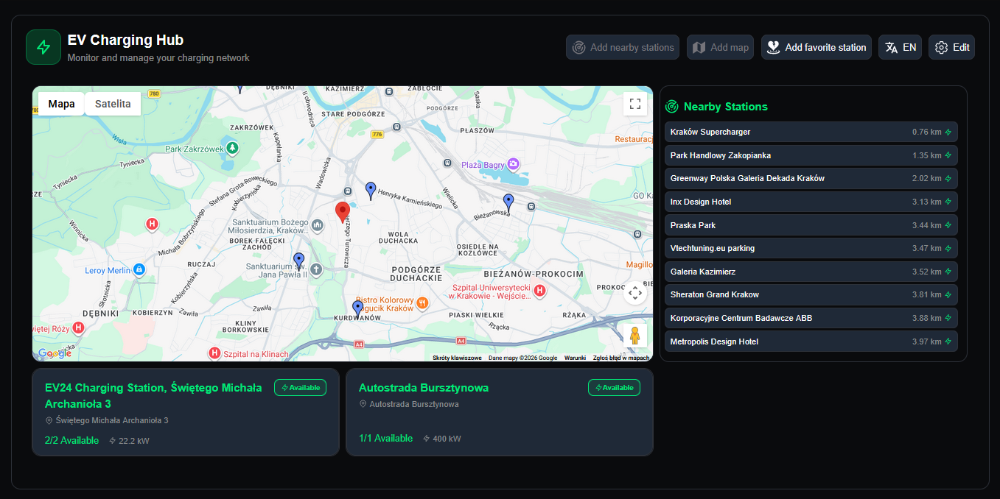
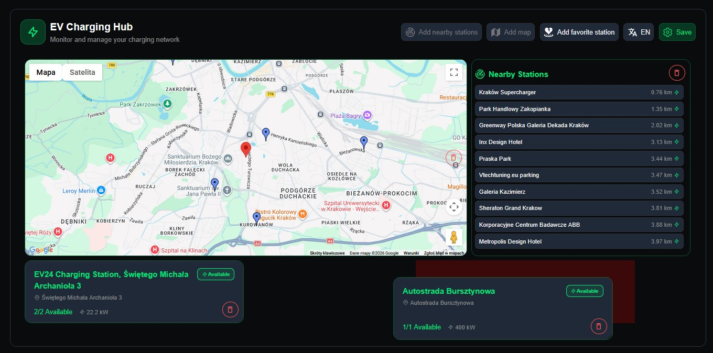
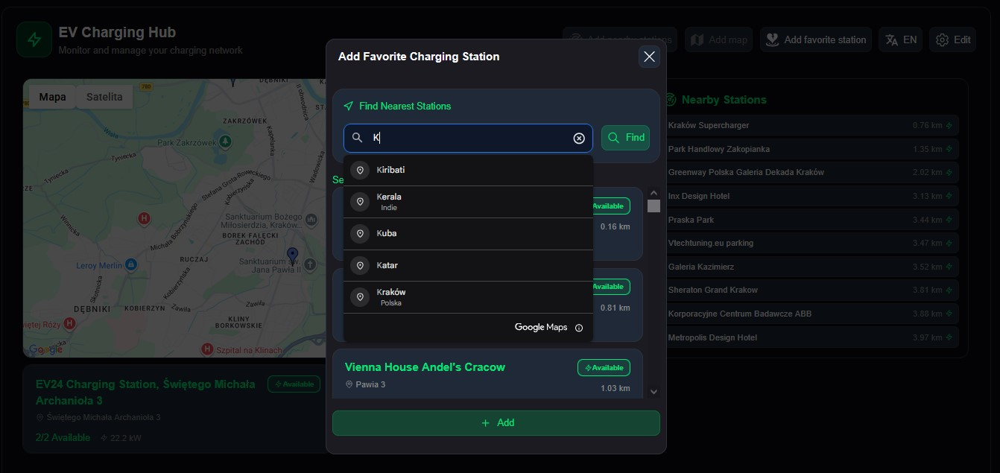
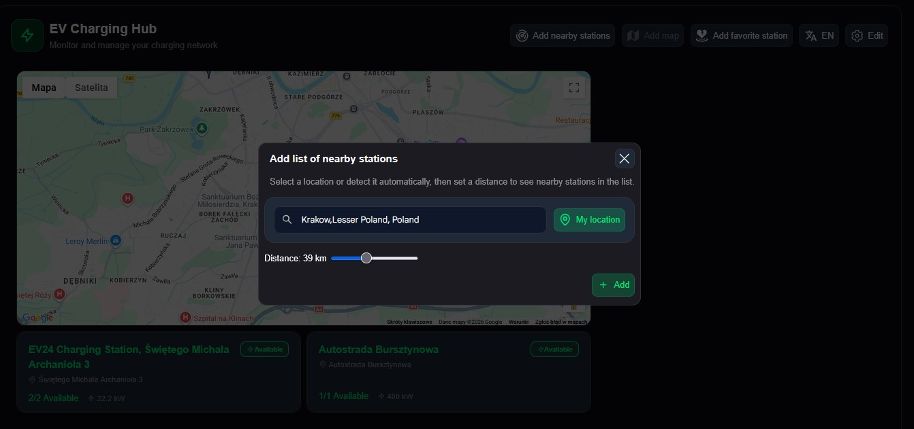
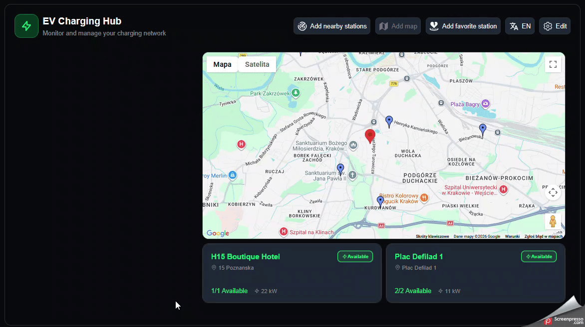

# VoltBoard

A modern dashboard for discovering and managing electric vehicle charging stations. VoltBoard provides an intuitive interface to search nearby stations, save favorites, and customize your dashboard with interactive widgets.

## External API Integrations

### Google Maps API

VoltBoard uses **Google Maps** for interactive map visualization and geolocation services.

### Open Charge Map API

VoltBoard uses **Open Charge Map** to retrieve charging station information.

## Features

- **Interactive Dashboard** – Customizable grid-based layout with draggable and resizable widgets
- **Google Maps Integration** – Real-time visualization of nearby charging stations on an interactive map
- **Station Search** – Find nearby stations by location with distance filtering
- **Favorite Stations** – Save and manage your favorite charging stations for quick access
- **Multi-language Support** – Full i18n support for Polish and English interfaces
- **Location Management** – Automatic geolocation detection with manual search capability
- **Real-time Data** – TanStack Query for efficient data fetching and caching
- **Modular Components** – Reusable, styled components built with Styled Components

## Tech Stack

- **Framework:** React 19 with TypeScript
- **Build Tool:** Vite
- **Styling:** Styled Components
- **Maps:** Google Maps API (@vis.gl/react-google-maps)
- **State Management & Data Fetching:** TanStack Query (React Query)
- **HTTP Client:** Axios
- **Layout:** React Grid Layout
- **Internationalization:** i18next & react-i18next
- **Icons:** React Icons
- **Code Quality:** ESLint with TypeScript support
- **Testing:** Vitest & React Testing Library

## Architecture & Project Structure

```
src/
├── api/                    # API integration layer
│   └── stations/          # Station-related API calls, types, and data mapping
├── components/            # React components
│   ├── Dashboard.tsx      # Main dashboard with grid layout
│   ├── MapContainer.tsx   # Google Maps integration
│   ├── LocationSearch.tsx # Location search functionality
│   ├── Modal.tsx          # Reusable modal component
│   ├── StationManager/    # Station selection and management
│   └── LocationManager/   # Location detection and management
├── hooks/                 # Custom React hooks
├── types/                 # TypeScript type definitions
├── utils/                 # Utility functions (storage, helpers)
├── styles/                # Global styles and theme configuration
├── constants/             # App-wide constants
├── i18n/                  # i18n configuration and translation files
└── mock/                  # Mock data for development
```

### Component Organization

- **Dashboard** – Root component managing widget state, layout changes, and modal dialogs
- **WidgetBody** – Generic widget renderer supporting multiple widget types (MAP, LIST, STATION)
- **StationManager** – Handles station filtering and selection
- **LocationManager** – Manages geolocation and location-based searches
- **MapContainer** – Renders Google Maps with station markers
- **NearbyStationList** – Displays stations near the user's location

### Styling Strategy

- Styled Components for scoped, dynamic styling
- Theme system for consistent color schemes and spacing
- CSS Grid Layout integration for dashboard flexibility

### Scalability Considerations

- Modular component structure for easy feature additions
- Custom hooks for logic reusability
- TanStack Query for intelligent caching and synchronization
- Type safety with TypeScript for refactoring confidence
- API abstraction layer for easy backend integration changes

## Screenshots

### Dashboard



### Edit Mode



### Add Favourite Stations



### Add Nearby Stations List



## Preview



### Setup

```bash
git clone https://github.com/yourusername/voltboard.git
cd voltboard
```

2. Install dependencies:

```bash
npm install
```

3. Create a `.env.local` file and add your Google Maps API key:

```
VITE_GOOGLE_MAPS_API_KEY=your_api_key_here
```

4. Start the development seand Open Charge Map rve and :

```bash
npm run dev
```

The application will
VITE_OPEN_CHARGE_MAP_API_KEY=your_api_key_here
be available at `http://localhost:5173`

## Available Scripts

- **`npm run dev`** – Start the Vite development server with Hot Module Replacement
- **`npm run build`** – Build the project for production (includes TypeScript compilation)
- **`npm run lint`** – Run ESLint to check code quality
- **`npm run preview`** – Preview the production build locally

## Author

**Paweł Tokarek** – Developer

For questions or suggestions, feel free to reach out or open an issue on GitHub.
